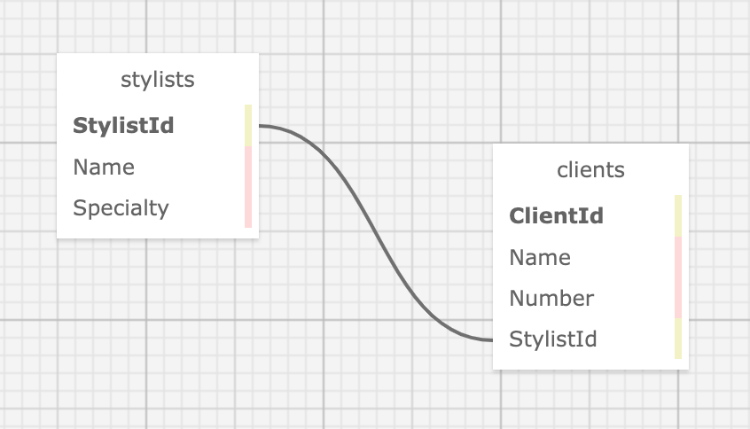

# **Eau Claire's Salon**
#### _a C# MVC Hair Salon Stylist & Client database application._

#### by **John Whitten**
#### March 10, 2022

## Technologies Used
- C#
- .NET 5.0
- REPL
- MySQL
- Razor
- ASP.NET Core


## Description
Claire who is the owner of Eau Claire's Hair Salon, and this is an MVC web application to help Claire manage her employees (stylists) and their clients. Claire is able to add a list of stylists working at the salon, and for each stylist, add clients who see that stylist. The stylists have specific specialties, so each client can only see (belong to) a single stylist.

### Schema


## Project Setup/Installation Instructions

### Install C#, .NET, MySQL Community Server and MySQL Workbench
- Open the terminal on your local machine
- If [C#](https://docs.microsoft.com/en-us/dotnet/csharp/) and [.NET](https://docs.microsoft.com/en-us/dotnet/) are not installed on your local device, follow the instructions here [here](https://www.learnhowtoprogram.com/c-and-net-part-time/getting-started-with-c/installing-c-and-net).
- If [MySQL Community Server](https://dev.mysql.com/downloads/mysql/) and [MySQL Workbench](https://www.mysql.com/products/workbench/) are not installed on your local device, follow the instructions [here](https://www.learnhowtoprogram.com/c-and-net-part-time/getting-started-with-c/installing-and-configuring-mysql).


### Clone the project
- Open the terminal on your local computer.
- Navigate to the parent directory of your preference.
- Clone this project using `$ git clone https://github.com/johnwhittenstudio/HairSalon.Solution`
- Navigate to the directory: ```$ cd HairSalon.Solution```
- Open in Vs code: ```$ code .```

### Import and connect the database
- Launch the MySQL server with the command ```mysql -uroot -p[YOUR-PASSWORD-HERE]```
- After the server starts running, open MySQL Workbench.
- Select the MySQL instance in the _MySQLConnections_ section.
- Select the **Navigator>Administration** tab.
- In the Navigator>Administration window, select **Data Import/Restore**; the Data Import window will open.
- In the **Import Options** section of the Data Import window, select **Import from Self-Contained File**.
- Click the dots at the end of the **Import from Self-Contained** file field (three dots for windows, two dots for Mac) and a pop up box will open. In the pop up box, navigate to the ```john_whitten.sql``` file in the root directory of the project (BestRest.Solution/). Once correct file is selected, click open. The pop up box will close itself.
- In the **Default Schema to be Imported To**, select the **New** button. 
- In the pop up box, name the schema ```john_whitten```. Click **Ok**.
- Navigate to the tab called **Import Progress** and click **Start Import** at the bottom right corner of the window.
- After you are finished with the above steps, reopen the **Navigator > Schemas** tab. Right click and select **Refresh All**. Your new test database will appear.
- Navigate to BestRest: ```$ cd HairSalon``` and type the following command in the terminal ```$ touch appsettings.json```
- Navigate to the appsettings.json file ```$ cd appsettings.json``` and enter:
```
{
    "ConnectionStrings": {
        "DefaultConnection": "Server=localhost;Port=3306;database=best_rest;uid=root;pwd=[YOUR-PASSWORD-HERE];"
    }
}
```

### Run the project
- Navigate to BestRest: ```$ cd HairSalon``` and type the following command in the terminal ```$ dotnet restore```
- Run the program in the console with the command ```$ dotnet run```

## Known Bugs
- _None._

## License
[MIT License](https://opensource.org/licenses/MIT) © 2022 _John Whitten_

## Contact
John Whitten: [johnwhitten.studio@gmail.com](mailto:johnwhitten.studio@gmail.com)
